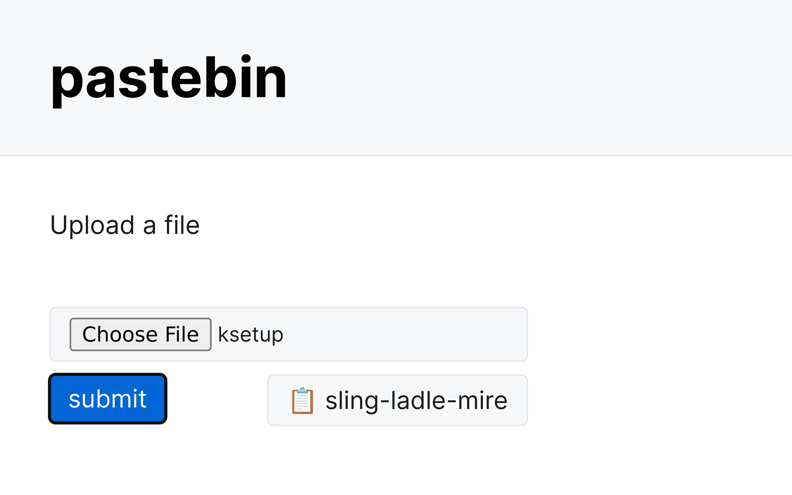

# bin

Simple pastebin service. 

- easy to remember identifiers
- minimal data storage

- dictionary file is used to generate identifiers
- files are stored on the file system directly
- file creation time (`ctime`) is used to delete old files

## CLI

```sh
$ post localhost:8000 < ~/bin/post
hued-impel-blush

$ curl localhost:8000/hued-impel-blush
curl --data-binary @- $@
```

## Web


